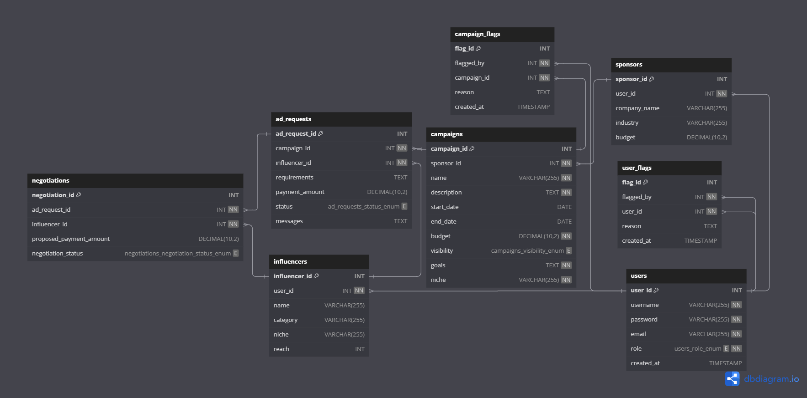

# MAD-I

## Influencer Engagement and Sponsorship Coordination Platform
It's a platform to connect Sponsors and Influencers so that sponsors can get their product/service advertised and influencers can get monetary benefit.

## Frameworks and Libraries Used
- **Flask**: For application code
- **Jinja2**: For HTML templates
- **Bootstrap**: For styling
- **SQLite**: For data storage

## ER Diagram

## API Endpoints
- `/api/data`: All Data

## Installation

- s1] Clone this repository and go to its directory

- s2] Install dependencies

        `pip install requirements.txt`

- s3] Run the flask project
        
        `flask --app app.py --debug run`

